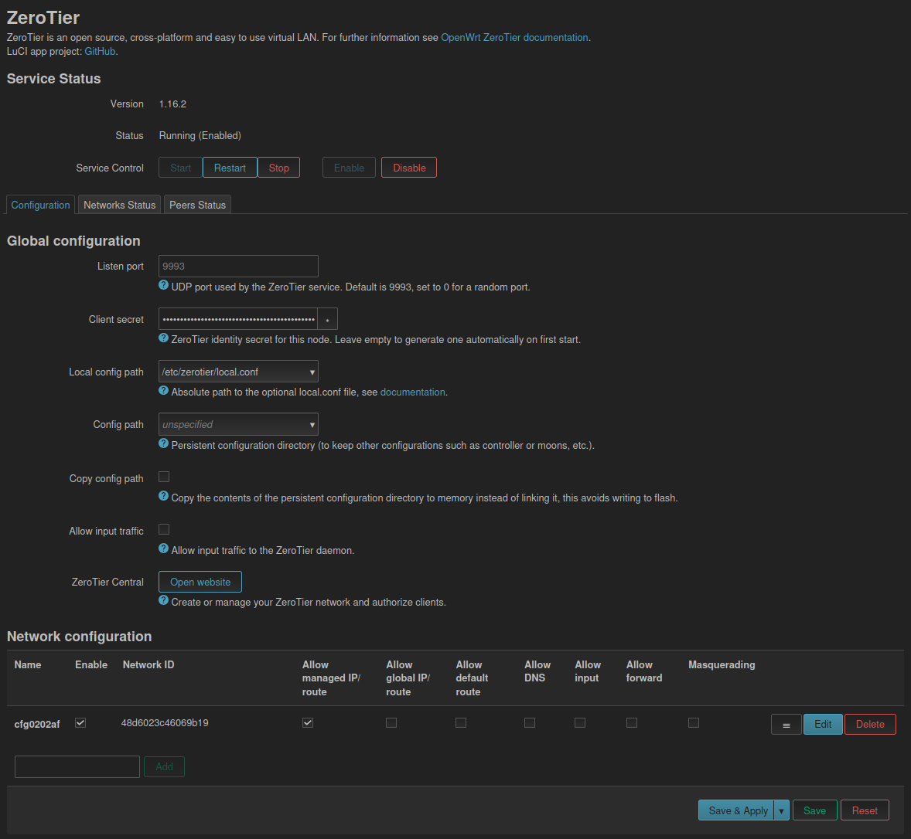
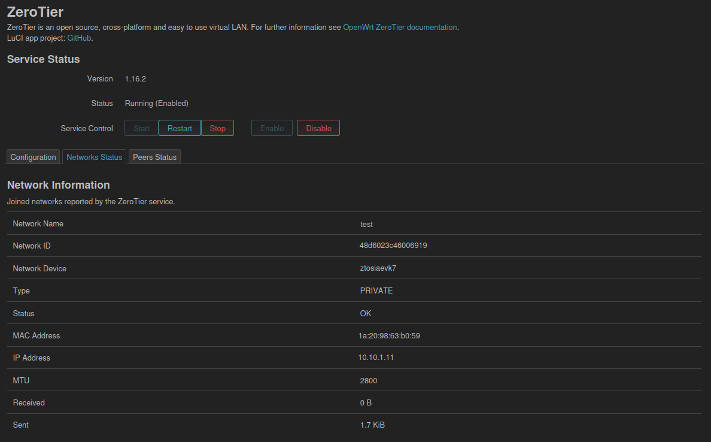
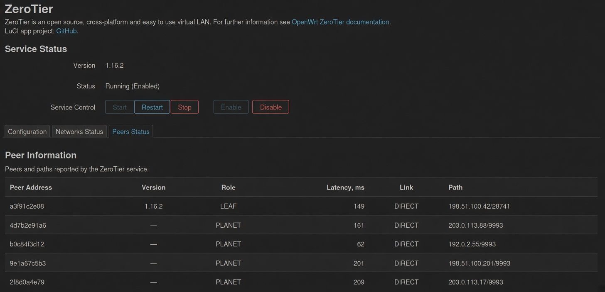

# luci-app-zerotier

LuCI application for configuring and managing ZeroTier on OpenWrt.  
Based on the package developed for the ImmortalWrt LuCI project.

## New Features

- Dedicated rpcd backend (luci.zerotier)
- Service control (start / stop / restart / enable / disable)
- Single overview page: status panel plus Configuration, Networks Status, and Peers Status tabs
- Networks Status: joined networks (name, ID, device, status, MAC, IPs, MTU, traffic)
- Peers Status: peers and paths from the ZeroTier service

## Interface

## Credits & License

Thanks to everyone who develops, maintains, reviews, tests, and contributes to luci-app-zerotier.

Licensed under the GNU General Public License v3.0 only (GPL-3.0-only).  
Copyright notices and SPDX license identifiers are preserved from the original source files.
