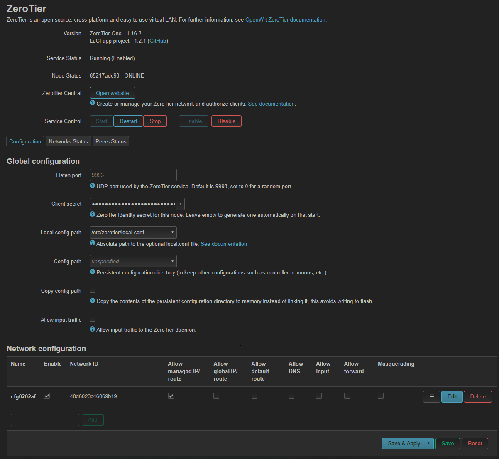
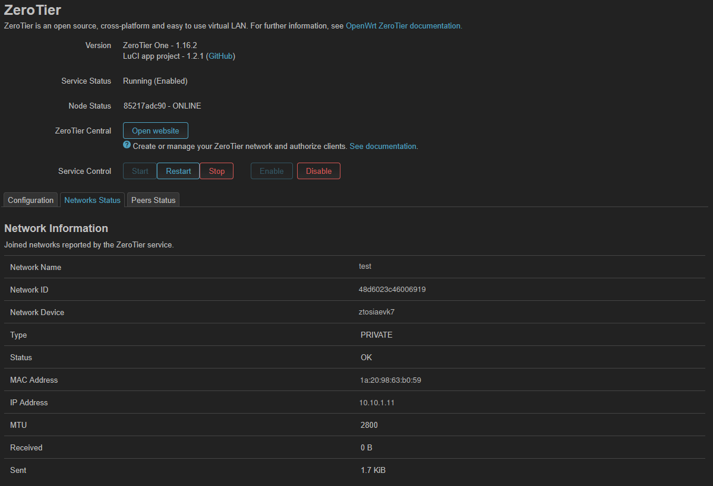
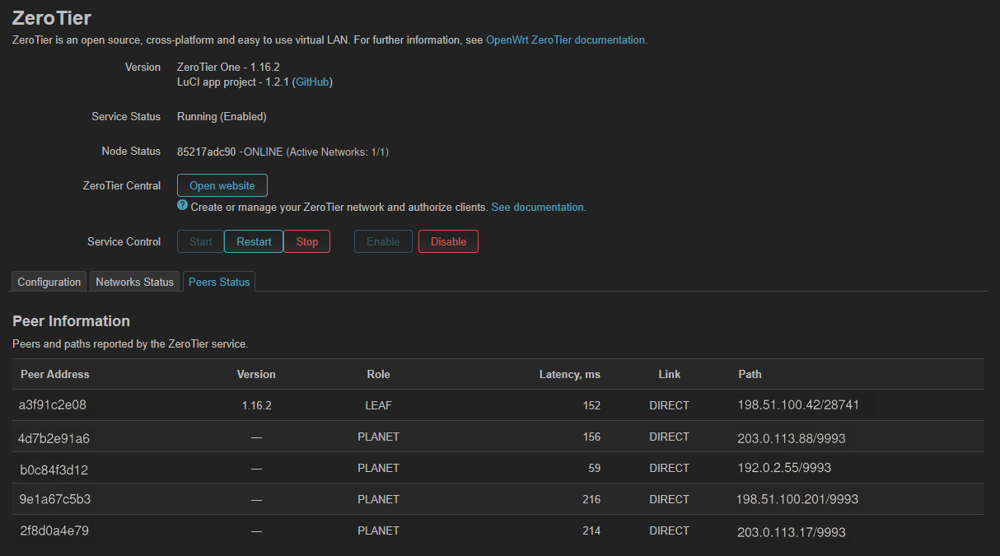

# luci-app-zerotier

LuCI application for configuring and managing ZeroTier on OpenWrt.  
Based on the package developed for the ImmortalWrt LuCI project.

## New Features

- Dedicated rpcd backend (luci.zerotier).
- **Service control** (start / stop / restart / enable / disable), with status:
  - Running / Stopped, Enabled / Disabled (autostart)
  - ZeroTier One version and LuCI app version (with project link)
  - Node information, networks summary (active / total)
- Single overview page: status panel plus **Configuration**, **Networks Status**, and **Peers Status** tabs:
  - **Networks Status** - joined networks from the ZeroTier service: network name, network ID, device, type, status, MAC address, IP address(es), MTU, received / sent traffic
  - **Peers Status** - peers from the ZeroTier service: peer address, version, role, latency, link (DIRECT / RELAY), preferred path
- Status widget on LuCI **Status -> Overview** (service, node, networks summary).
- Feature detection for OpenWrt vs ImmortalWrt (extra firewall / network options only when supported).

## Interface

## Credits & License

Thanks to the [ImmortalWrt LuCI](https://github.com/immortalwrt/luci) contributors who developed and maintained the original luci-app-zerotier package, and to everyone who helps improve this fork.

Service control UI patterns were inspired by luci-app-pbr by [@stangri](https://github.com/stangri).

Licensed under the GNU General Public License v3.0 only (GPL-3.0-only).  
Copyright notices and SPDX license identifiers are preserved from the original source files.
